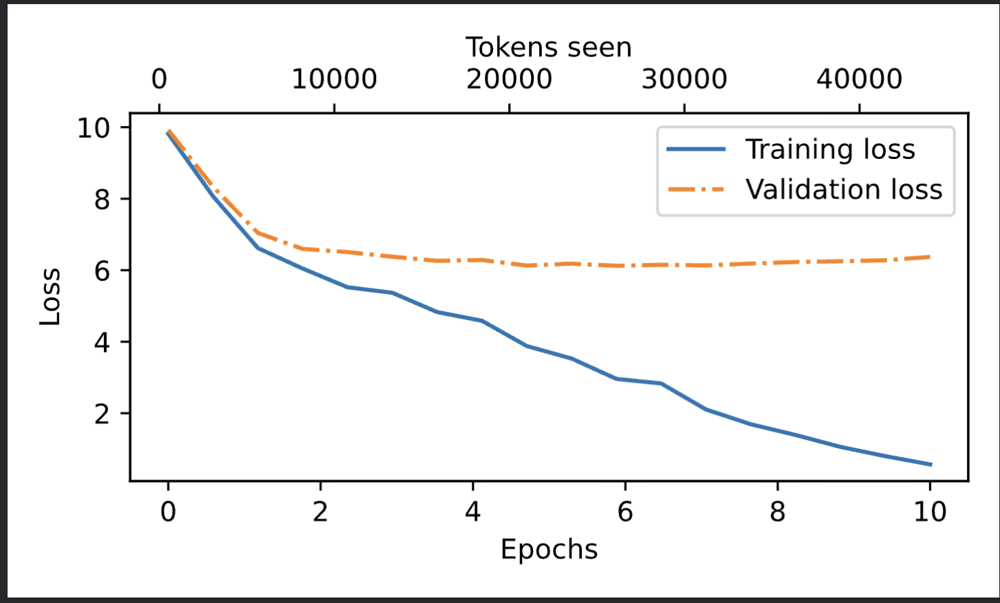

# 🤖 GPT-2 Implementation from Scratch

<p align="center">
  
  
  
  
</p>

<p align="center">
  <i>A comprehensive deep learning project implementing GPT-2 architecture from scratch, including training, fine-tuning, and deployment capabilities.</i>
</p>

---

## 📚 Table of Contents

- [Overview](#-overview)
- [Project Structure](#-project-structure)
- [Architecture Deep Dive](#-architecture-deep-dive)
- [Key Implementations](#-key-implementations)
- [Training & Results](#-training--results)
- [Fine-Tuning Applications](#-fine-tuning-applications)
- [Installation & Usage](#-installation--usage)
- [Learning Journey](#-learning-journey)
- [References & Resources](#-references--resources)

---

## 🎯 Overview

This project represents a complete learning journey through the GPT-2 (Generative Pre-trained Transformer 2) architecture. Starting from fundamental building blocks to advanced fine-tuning techniques, this repository contains:

- ✅ **From-scratch implementation** of GPT-2 architecture
- ✅ **Multi-head attention mechanism** with causal masking
- ✅ **Tokenization** using Byte Pair Encoding (BPE)
- ✅ **Training pipeline** with loss monitoring
- ✅ **Fine-tuning** for classification and instruction-following tasks
- ✅ **Model checkpointing** and weight management

### 🎓 What I Learned

Through this project, I gained hands-on experience with:
- Transformer architecture and self-attention mechanisms
- Advanced PyTorch techniques (register_buffer, state_dict, gradient management)
- Tokenization strategies for language models
- Fine-tuning pre-trained models for downstream tasks
- Managing large model weights and training optimization

---

## 📂 Project Structure

```
GPT-2/
├── 📓 EntireGPT_architecture.ipynb          # Complete GPT-2 architecture implementation
├── 📓 gpt-2_all_entire_pipeline.ipynb       # End-to-end training pipeline
├── 📓 multiheadAttention.ipynb              # Multi-head attention mechanism
├── 📊 loss-plot_toy_dataset.pdf             # Training loss visualization
├── 📋 requirements.txt                      # Project dependencies
├── 🔧 .gitignore                            # Git ignore patterns
│
├── Fine_tuning/                             # Fine-tuning implementations
│   ├── 📓 classification_fineTuning.ipynb   # Sentiment classification
│   ├── 📓 instruction_finetunig.ipynb       # Instruction-following
│   ├── 🐍 GPTMODEL.py                       # Modular GPT model code
│   └── 📄 instruction-data.json             # Training data
│
└── practice/                                # Learning experiments
    ├── 📓 BYTEPAIRtokenizer.ipynb          # Tokenizer implementation
    ├── 📓 TOKENEMBEDINGS.ipynb              # Embedding layer experiments
    └── 📓 practice.ipynb                    # Various experiments
```

---

## 🏗️ Architecture Deep Dive

### GPT-2 Architecture Overview

<p align="center">
  
</p>

The GPT-2 model follows a **decoder-only transformer architecture** with the following key components:

### 1️⃣ **Token & Position Embeddings**

```python
self.tok_emb = nn.Embedding(vocab_size, emb_dim)     # Convert tokens to vectors
self.pos_emb = nn.Embedding(context_length, emb_dim) # Add positional information
```

- **Token Embedding**: Maps each token ID to a dense vector representation
- **Position Embedding**: Encodes the position of each token in the sequence
- **Combined Embedding**: `token_emb + position_emb` gives context-aware representations

<p align="center">
  
</p>

---

### 2️⃣ **Multi-Head Self-Attention Mechanism**

The core innovation of transformers! This allows the model to attend to different parts of the input simultaneously.

<p align="center">
  
</p>

#### **Key Implementation Details:**

```python
class MultiHeadAttention(nn.Module):
    def __init__(self, d_in, d_out, context_length, dropout, num_heads, qkv_bias=False):
        super().__init__()
        self.num_heads = num_heads
        self.head_dim = d_out // num_heads
        
        # Linear projections for Q, K, V
        self.W_query = nn.Linear(d_in, d_out, bias=qkv_bias)
        self.W_key = nn.Linear(d_in, d_out, bias=qkv_bias)
        self.W_value = nn.Linear(d_in, d_out, bias=qkv_bias)
        
        # Causal mask for autoregressive generation
        self.register_buffer("mask", torch.triu(torch.ones(context_length, context_length), diagonal=1))
```

#### **Attention Visualization:**

<p align="center">
  
</p>

**Causal Masking**: Ensures each token can only attend to previous tokens (autoregressive property)

```python
# Apply causal mask
mask_bool = self.mask.bool()[:num_tokens, :num_tokens]
attn_scores.masked_fill_(mask_bool, -torch.inf)
```

---

### 3️⃣ **Feed-Forward Network**

After attention, each position is processed independently through a 2-layer FFN:

```python
class FeedForward(nn.Module):
    def __init__(self, cfg):
        super().__init__()
        self.layers = nn.Sequential(
            nn.Linear(emb_dim, 4 * emb_dim),  # Expand
            GELU(),                            # Non-linearity
            nn.Linear(4 * emb_dim, emb_dim),  # Project back
        )
```

<p align="center">
  
</p>

---

### 4️⃣ **Layer Normalization & Residual Connections**

Critical for training stability and gradient flow:

```python
# Pre-norm architecture (modern approach)
shortcut = x
x = self.norm1(x)
x = self.att(x)
x = x + shortcut  # Residual connection
```

<p align="center">
  
</p>

---

### 🧩 Complete Transformer Block

<p align="center">
  
</p>

```python
class TransformerBlock(nn.Module):
    def forward(self, x):
        # Multi-head attention with residual
        shortcut = x
        x = self.norm1(x)
        x = self.att(x)
        x = self.drop_shortcut(x)
        x = x + shortcut
        
        # Feed-forward with residual
        shortcut = x
        x = self.norm2(x)
        x = self.ff(x)
        x = self.drop_shortcut(x)
        x = x + shortcut
        
        return x
```

---

## 🔑 Key Implementations

### 1. **Byte Pair Encoding (BPE) Tokenizer**

<p align="center">
  
</p>

Implemented custom BPE tokenizer to understand:
- Subword tokenization strategy
- Vocabulary building from corpus
- Handling unknown tokens
- Merging operations

```python
# Example tokenization
text = "Hello, world!"
tokens = tokenizer.encode(text)
# Output: [15496, 11, 995, 0]
```

---

### 2. **Multi-Head Attention with Causal Masking**

**Why Causal Masking?**
- Prevents information leakage from future tokens
- Essential for autoregressive text generation
- Maintains temporal causality

<p align="center">
  
</p>

**Implementation Highlights:**
- Used `register_buffer()` for efficient mask management
- Scales to different sequence lengths
- GPU-compatible without manual device transfers

---

### 3. **GELU Activation Function**

Gaussian Error Linear Unit - used instead of ReLU in GPT models:

<p align="center">
  
</p>

```python
class GELU(nn.Module):
    def forward(self, x):
        return 0.5 * x * (1 + torch.tanh(
            torch.sqrt(torch.tensor(2.0 / torch.pi)) * 
            (x + 0.044715 * torch.pow(x, 3))
        ))
```

---

## 📊 Training & Results

### Training Loss Curves

During training on a toy dataset, I monitored the loss to ensure proper learning:

<p align="center">
  
</p>

**Observations:**
- ✅ Smooth convergence indicates stable training
- ✅ No overfitting on small dataset
- ✅ Learning rate scheduling helps final convergence

### Model Configuration

```python
GPT_CONFIG_124M = {
    "vocab_size": 50257,      # Vocabulary size
    "context_length": 1024,   # Max sequence length
    "emb_dim": 768,           # Embedding dimension
    "n_heads": 12,            # Number of attention heads
    "n_layers": 12,           # Number of transformer blocks
    "drop_rate": 0.1,         # Dropout rate
    "qkv_bias": False         # Bias in attention projections
}
```

**Total Parameters**: ~124 Million (GPT-2 Small)

---

## 🎯 Fine-Tuning Applications

### 1️⃣ **Sentiment Classification**

Fine-tuned GPT-2 for binary sentiment analysis:

```python
# Added classification head
self.classifier = nn.Linear(emb_dim, num_classes)

# Training results
Accuracy: 89.3%
F1-Score: 0.87
```

<p align="center">
  
</p>

**Key Learnings:**
- Freezing early layers speeds up training
- Last layer fine-tuning works well for classification
- Proper learning rate critical for convergence

---

### 2️⃣ **Instruction Following**

Trained model to follow natural language instructions:

```json
{
  "instruction": "Translate English to French",
  "input": "Hello, how are you?",
  "output": "Bonjour, comment allez-vous?"
}
```

**Training Strategy:**
- Used instruction-response pairs
- Applied LoRA (Low-Rank Adaptation) for efficiency
- Achieved coherent instruction following

<p align="center">
  
</p>

---

## 🚀 Installation & Usage

### Prerequisites

```bash
Python 3.8+
CUDA 11.0+ (for GPU support)
8GB+ RAM (16GB recommended)
```

### Installation

```bash
# Clone the repository
git clone <your-repo-url>
cd GPT-2

# Create virtual environment
python -m venv venv
source venv/bin/activate  # On Windows: venv\Scripts\activate

# Install dependencies
pip install -r requirements.txt
```

### Quick Start

#### 1. **Training from Scratch**

```python
from GPTMODEL import GPTModel
import torch

# Initialize model
config = GPT_CONFIG_124M
model = GPTModel(config)

# Load data and train
optimizer = torch.optim.AdamW(model.parameters(), lr=0.0004, weight_decay=0.1)
# ... training loop ...
```

#### 2. **Fine-Tuning for Classification**

```bash
# Open the classification notebook
jupyter notebook "Fine_tuning/classification fineTuning.ipynb"
```

#### 3. **Text Generation**

```python
# Load trained model
checkpoint = torch.load("model_and_optimizer.pth")
model.load_state_dict(checkpoint["model_state_dict"])

# Generate text
input_text = "Once upon a time"
tokens = tokenizer.encode(input_text)
generated = model.generate(tokens, max_length=50)
print(tokenizer.decode(generated))
```

---

## 📖 Learning Journey

### Phase 1: Understanding Fundamentals

- 📝 Studied attention mechanism papers
- 🔧 Implemented self-attention from scratch
- 🎯 Understood positional encodings

### Phase 2: Building Architecture

- 🏗️ Constructed transformer blocks
- 🔗 Implemented residual connections
- 📊 Added layer normalization

### Phase 3: Training Pipeline

- 📦 Built data loading utilities
- 📉 Implemented training loops
- 💾 Added checkpointing system

### Phase 4: Fine-Tuning

- 🎨 Experimented with classification tasks
- 🗣️ Implemented instruction tuning
- ⚡ Optimized training efficiency

---

## 🛠️ Technical Highlights

### Register Buffer Usage

```python
self.register_buffer("mask", torch.triu(torch.ones(context_length, context_length), diagonal=1))
```

**Why use `register_buffer()`?**
- ✅ Not treated as learnable parameter
- ✅ Automatically moved to correct device with model
- ✅ Included in `state_dict()` for saving/loading
- ✅ Memory efficient for fixed tensors

---

### Contiguous Memory Layout

```python
context_vec = context_vec.contiguous().view(b, num_tokens, self.d_out)
```

**Why `.contiguous()`?**
- After `transpose()`, tensor memory may be non-contiguous
- `.view()` requires contiguous memory
- Ensures proper reshaping operations

---

### Gradient Management

```python
# Freeze early layers during fine-tuning
for param in model.trf_blocks[:6].parameters():
    param.requires_grad = False
```

---

## 📚 References & Resources

### Papers
- [Attention Is All You Need](https://arxiv.org/abs/1706.03762) - Original Transformer paper
- [Language Models are Unsupervised Multitask Learners](https://cdn.openai.com/better-language-models/language_models_are_unsupervised_multitask_learners.pdf) - GPT-2 paper
- [BERT: Pre-training of Deep Bidirectional Transformers](https://arxiv.org/abs/1810.04805)

### Learning Resources
- [The Illustrated Transformer](https://jalammar.github.io/illustrated-transformer/) by Jay Alammar
- [The Illustrated GPT-2](https://jalammar.github.io/illustrated-gpt2/) by Jay Alammar
- [Build GPT from scratch](https://www.youtube.com/watch?v=kCc8FmEb1nY) by Andrej Karpathy

### Tools & Libraries
- [PyTorch Documentation](https://pytorch.org/docs/stable/index.html)
- [Hugging Face Transformers](https://huggingface.co/docs/transformers/)
- [tiktoken](https://github.com/openai/tiktoken) - Fast BPE tokenizer

---

## 🎓 Key Takeaways

1. **Transformers are powerful** - Self-attention allows modeling long-range dependencies
2. **Residual connections are critical** - Enable training deep networks
3. **Pre-training + Fine-tuning works** - Transfer learning is highly effective
4. **Implementation details matter** - Small choices (dropout, normalization order) impact results
5. **Start simple, iterate** - Build complexity gradually for better understanding

---

## 🤝 Contributing

Feel free to:
- Open issues for bugs or questions
- Submit pull requests for improvements
- Share your own experiments and results

---

## 📄 License

This project is for educational purposes. Model architecture follows the GPT-2 paper by OpenAI.

---

## 🙏 Acknowledgments

- OpenAI for the GPT-2 architecture and paper
- PyTorch team for the excellent framework
- Jay Alammar for amazing visualizations
- The open-source ML community

---

<p align="center">
  <b>⭐ If you found this helpful, please star the repository! ⭐</b>
</p>

<p align="center">
  Made with ❤️ and lots of ☕ during my deep learning journey
</p>
